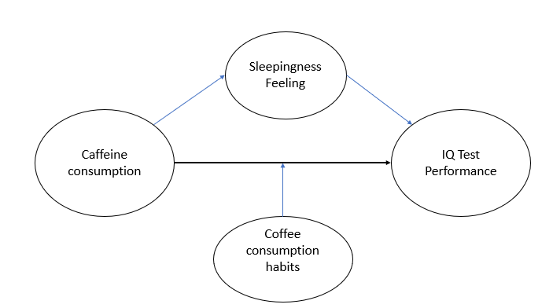
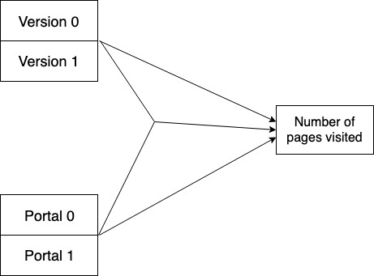
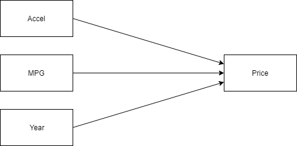

```{r setup, include=FALSE}
knitr::opts_chunk$set(echo = TRUE)
```


\tableofcontents


#Part 1 - Design and set-up of true experiment 

##The motivation for the planned research. 
(Max 250 words)
The coffee is today the most consumed drink in the world and it is told to increase your performance and concentration. We want to challenge this idea and verify scientifically if this is a valid idea. We want to test how coffee consumption (and the level of caffeine inside) affect the result of an IQ test.  We are most interesting and seeing what the affect is on TU Delft students like ourselves. So the participants will be recruited from the TU Delft student body.

## The theory underlying the research.  
(Max 250 words) Preferable based on theories reported in literature
There is a large body of literature available on the effects of caffeine on the performance in cognitive tasks. Literature generally supports the idea that coffee improves this performance, see e.g. (Jarvis, 1993; Nehlig, 2010; Rogers et al., 2008). In a brief survey of the relevant literature we did not find any studies specifically addressing students. We would like to investigate this part of the population in more detail.

Jarvis, M. J. (1993). Does caffeine intake enhance absolute levels of cognitive performance?. Psychopharmacology, 110(1-2), 45-52.
Rogers, P. J., Smith, J. E., Heatherley, S. V., & Pleydell-Pearce, C. W. (2008). Time for tea: mood, blood pressure and cognitive performance effects of caffeine and theanine administered alone and together. Psychopharmacology, 195(4), 569.
Nehlig, A. (2010). Is caffeine a cognitive enhancer?. Journal of Alzheimer's Disease, 20(s1), S85-S94.


##Research questions 
The research question that will be examined in the experiment (or alternatively the hypothesis that will be tested in the experiment)
How does caffeine level in coffee increases IQ test score ?

##The related conceptual model 

The conceptual model can be found below.



##Experimental Design 
Note that the study should have a true experimental design
The experiment is a four groups, post test only, randomized controlled trail. Participants will be separated randomly in 4 different groups that will get different amount of caffeine, they will then perform a test and get a score on this test.

## Experimental procedure 
Describe how the experiment will be executed step by step

The participants will be separated into four groups randomly. One group will do the IQ test without any prior coffee consumption while the three other groups will do the test half an hour after coffe consumption where the coffee will have different levels of caffeine according to the groups (20, 100 200 mg). This will allow us to measure the general impact of drinking coffee on an IQ test but it will also allow us to test the difference between each caffeine level.


## Measures
Describe the measure that will be used
The Coffe consumption will be measured in ml.
The perfomance in an IQ test will be a simple integer number on the scale from 0-200 where the mean is around 100.
Sleepingness will be given by the participants on the scale from 0-10 where 10 means the highest level of sleepingness.
The amount of caffeine will be measured in mg.
Prior coffeedrinking habits will be given by participants. They will be asked how much coffee they typically drink on a normal day.


## Participants
Describe which participants will recruit in the study and how they will be recruited

Since we are just going to make this experiment on the effects of coffee consumption on students at TU Delft we need to find participants from that group of people. Emails will be sent out to the student body explaining the theory of the experiments and willing volunteers asked to fill in a form. We will try to contact an external company of some sort to get some credit or coupons that we can give to participants as a reward for helping out. 

## Suggested statistical analyses
Describe the statistical test you suggest to care out on the collected data
We will use a one way Analysis of Variance (ANOVA) test between groups. Indeed, since the IQ test is designed to follow a gaussian distribution, we just want to compare the mean of each group.

#Part 2 - Generalized linear models

## Question 1 Twitter sentiment analysis (Between groups - single factor) 


### Collecting tweets, and data preparation
We collected Tweets for the three celebrities Beyonce, Madonna and '' MickaelJackson.
The code can be found in the markdown file.

```{r, echo=FALSE, message=FALSE, warning=FALSE, include = FALSE}

#during writing you could add "eval = FALSE",  kntr will than not run this code chunk (take some time do)
#setwd("C:\Users\thoru\Google Drive\Tu Delft\Seminar\Coursework A")
#setwd("~/surfdrive/Teaching/own teaching/IN4125 - Seminar Research Methodology for Data Science/2019/coursework A") 
# apple , note use / instead of \, which used by windows


#install.packages("twitteR", dependencies = TRUE)
library(twitteR)
#install.packages("RCurl", dependencies = T)
library(RCurl)
#install.packages("bitops", dependencies = T)
library(bitops)
#install.packages("plyr", dependencies = T)
library(plyr)
#install.packages('stringr', dependencies = T)
library(stringr)
#install.packages("NLP", dependencies = T)
library(NLP)
#install.packages("tm", dependencies = T)
library(tm)
#install.packages("wordcloud", dependencies=T)
#install.packages("RColorBrewer", dependencies=TRUE)
library(RColorBrewer)
library(wordcloud)
#install.packages("reshape", dependencies=T)
library(reshape)
#install.packages("openssl")
library(openssl)#for Twitter
library(base64enc)#for twitter
#install.packages("httr")
library(httr)#for twitter

library(car)#for leveneTest
#install.packages("ez")
library(ez) 
#install.packages("gplots")
library(gplots) # to plot the means for the celebrities
#install.packages("ggplot2")
library(ggplot2) # to plot the means for the simple effect analysis
#install.packages("nlme")
library(nlme) # For multilevel analysis
#install.packages("pander")
library(pander) # For fancy result reporting


################### functions

  
clearTweets <- function(tweets, excl) {
  
  tweets.text <- sapply(tweets, function(t)t$getText()) #get text out of tweets 

  
  tweets.text = gsub('[[:cntrl:]]', '', tweets.text)
  tweets.text = gsub('\\d+', '', tweets.text)
  tweets.text <- str_replace_all(tweets.text,"[^[:graph:]]", " ") #remove graphic
  
  
  corpus <- Corpus(VectorSource(tweets.text))
  
  corpus_clean <- tm_map(corpus, removePunctuation)
  corpus_clean <- tm_map(corpus_clean, content_transformer(tolower))
  corpus_clean <- tm_map(corpus_clean, removeWords, stopwords("english"))
  corpus_clean <- tm_map(corpus_clean, removeNumbers)
  corpus_clean <- tm_map(corpus_clean, stripWhitespace)
  corpus_clean <- tm_map(corpus_clean, removeWords, c(excl,"http","https","httpst"))
  

  return(corpus_clean)
} 


## capture all the output to a file.

################# Collect from Twitter

# # for creating a twitter app (apps.twitter.com) see youtube https://youtu.be/lT4Kosc_ers
# consumer_key <-'k9vUb4jWT1EoYRoCEsE3s8vnc'
# consumer_scret <- 'Q6U0Ek1umFvWWGuOVsBOekG7xM5R1cXYkIMx4q85XtWbWqHPo4'
# access_token <- '746835948688805889-q9LEUy2zqL8rigTon9FpqNpH6TkSNvk'
# access_scret <- 'yc3IFL7cQsEMNCLhXuyUvaOv5Wiick0S7scXRU5G0ZICg'
# 
# #consumer_key <-'S3HE6pNUsmDP3LxMSDgRw8kx8'
# #consumer_scret <- '1aLg11NynVF4q93uaxHuCkd9GpIZxtaePxlvVZoKHrmPjrQIoC '
# #access_token <- '1079739876080340992-O9MHCV8yIbP4fpCXnktPDKTerIk4i8'
# #access_scret <- 'ZYi6mkuPA2zQDw3jqtK9xKvRWc6Yj7xHmCCwMNLpyI0kY'
# 
# source("your_twitter.R") #this file will set my personal variables for my twitter app, adjust the name of this file. use the provide template your_twitter.R
# 
# setup_twitter_oauth(consumer_key,consumer_scret, access_token,access_scret) #connect to  twitter app
# #setup_twitter_oauth("m0c8uiiQq4RtDjAAZTStL92S","qDsqOGPTyISMCS4hqiP8nQ0cGFXZe7a9ek5QpICDjp7XzxIIai", "746835948688805889-pyCZUMD8Cp7OqgjlSNhiLlB3dxzmcMu","h75BZz6Xih9Uwgh4YQgDEPrkoKBnyCQ82iOCZUrlt61xJ") #connect to  twitter app

##### This example uses the following 3 celebrities: Donald Trump, Hillary Clinton, and Bernie Sanders
##  You should replace this with your own celebrities, at least 3, but more preferred 
##  Note that it will take the computer some to collect the tweets

# tweets_Beyonce <- searchTwitter("#Beyonce", n=1000, lang="en", resultType="recent") #1000 recent tweets about Beyonce, in English
# tweets_Madonna <- searchTwitter("#Madonna", n=1000, lang="en", resultType="recent") #1000 recent tweets about Madonna
# tweets_MickaelJackson <- searchTwitter("#MichaelJackson", n=1000, lang="en", resultType="recent") #1000 recent tweets about  MickaelJackson

# Save an object to a file?
# saveRDS(tweets_Beyonce, file = "tweets_Beyonce.rds")
# saveRDS(tweets_Madonna, file = "tweets_Madonna.rds")
# saveRDS(tweets_MickaelJackson, file = "tweets_MickaelJackson.rds")
##Restore the object

 tweets_Beyonce =readRDS( file = "tweets_Beyonce.rds")
 tweets_Madonna =readRDS( file = "tweets_Madonna.rds")
 tweets_MickaelJackson =readRDS( file = "tweets_MickaelJackson.rds")

######################## Sentiment analysis

tweets_Beyonce.text <- laply(tweets_Beyonce, function(t)t$getText()) #get text out of tweets 
tweets_Madonna.text <- laply(tweets_Madonna, function(t)t$getText()) #get text out of tweets
tweets_MickaelJackson.text <- laply(tweets_MickaelJackson, function(t)t$getText()) #get text out of tweets


#taken from https://github.com/mjhea0/twitter-sentiment-analysis
pos <- scan('positive-words.txt', what = 'character', comment.char=';') #read the positive words
neg <- scan('negative-words.txt', what = 'character', comment.char=';') #read the negative words

source("sentiment3.R") #load algoritm
# see sentiment3.R form more information about sentiment analysis. It assigns a intereger score
# by substracitng the number of occurrence of negative words from that of positive words

analysis_Beyonce <- score.sentiment(tweets_Beyonce.text, pos, neg)
analysis_Madonna <- score.sentiment(tweets_Madonna.text, pos, neg)
analysis_MickaelJackson <- score.sentiment(tweets_MickaelJackson.text, pos, neg)


sem<-data.frame(analysis_Beyonce$score, analysis_Madonna$score, analysis_MickaelJackson$score)


semFrame <-melt(sem, measured=c(analysis_Beyonce.score,analysis_Madonna.score, analysis_MickaelJackson.score ))
names(semFrame) <- c("Person", "score")
semFrame$Person <-factor(semFrame$Person, labels=c("Beyonce", "Madonna", "MichaelJackson")) # change the labels for your celibrities

subsetBeyonce <-semFrame[which(semFrame$Person == 'Beyonce'),]
subsetMadonna <-semFrame[which(semFrame$Person == 'Madonna'),]
subsetMickaelJackson <-semFrame[which(semFrame$Person == 'MichaelJackson'),]


#The data you need for the analyses can be found in semFrame

```
###Conceptual model

Make a conceptual model for the following research question: Is there a difference in the sentiment of the tweets related to the different celebrities?


We can see that the sentiment of tweets related to different celebrity is directly connected to the celebrity itself. 
Therefor the conceptual model is very simple consisting of two variables, "Celebrity" and "Sentiment".

### Homogeneity of variance analysis
Here we will analyze the homogeneity of variance of sentiments of the tweets of the different celebrities

Lets start by looking at how the boxplot looks for each person and the relevant sentiment score. We can already see from looking at the boxplot that the variance does not seem to be the same for all  celibirities. Madonna seems to have the broadest spectrum and the median line hits a bit different places depenfing on the celebrities.

```{r}
#this was not here in the intermediate report.
#include your code and output in the document
boxplot(score ~ Person, data=semFrame, main="Boxplot of sentiment for each person",
        xlab="Person", ylab="Sentiment")

levene = leveneTest( semFrame$score,semFrame$Person, center = median)
```
The Levene test results in a very low p-value $`r levene[1, "Pr(>F)"]`$. Therefore the hypothesis of equal variances is rejected and it is concluded that there is a difference between the variances in the population. Therefore the variance is not considered to be homogeneous.

### Visual inspection
Looking at the figures here below we see that the sentiment scores for all the celebrities follow a very similar distribution that looks a lot like a normal distribution.
But by inspecting the histograms we can see that the distribution is not entirely the same. Therefore we will do a furter inspection to see how the distributions differ from each other. 

```{r,fig.width = 5, fig.height =4}
#include your code and output in the document

hist(subsetBeyonce$score)
hist(subsetMadonna$score)
hist(subsetMickaelJackson$score)
meanBeyonce<-mean(subsetBeyonce$score)
meanMadonna<-mean(subsetMadonna$score)
meanMickaelJackson<-mean(subsetMickaelJackson$score)
stdBeyonce<-sd(subsetBeyonce$score)
stdMadonna<-sd(subsetMadonna$score)
stdMickaelJackson<-sd(subsetMickaelJackson$score)

```


### Mean sentiments

Here below we plot the means of each class using plotmeans from the package gplots.  We can see that the mean for Beyonce is `r meanBeyonce`, for Madonna is `r meanMadonna` and for Mickael Jackson it is `r meanMickaelJackson`. Where a lower value means that the sentiment analysis is more negative. Just by looking at the means we see that they are considerably far from each other. As well we have te standard deviations 0.958, 0.897, 0.944 in the same respective order as before. 
```{r}
plotmeans(score ~ Person, data = semFrame,mean.labels = TRUE,connect = FALSE,ylim = c(-0.1,0.8))
```

### Linear model
```{r}
#include your code and output in the document
 model0<- lm(score ~ 1, data = semFrame) #model without predictor
 model1<- lm(score ~ Person, data = semFrame) #model with predictor
 AnovaResults <-anova(model0,model1)
```
Here we have tied two different linear models to fit put outcome. Model0 is a simple model where the sentiment score stands alone, but model1 has the celebrity in there as well. 
The calculated f-value, F(2,2997) is 31.640 and the p- value is very small and well below .0001. Since the p-value is so small it indicates that the sentiment of tweets is significantly different depending on what celebrity is mentioned in the tweet.
 


### Post Hoc analysis
Now a post-hoc analysis is performed to examine which of the tweets differ from othere celebrity tweets

```{r}
#include your code and output in the document
BonferroniResults <- pairwise.t.test(semFrame$score, semFrame$Person, paired = FALSE, p.adjust.method = "bonferroni")
BonferroniP <- BonferroniResults$p.value
BonferroniP
```
We chose to use the Bonferroni correction to conduct this post-hoc analysis. There the p-values are multiplied bu the number of comparisons.

According to results here above all of the celebrity pair comparisons have a low p-value that indicates again that the sentiment is dependent on what celebrity it is in relation to.


### Report section for a scientific publication
We analysed sentiment scores of tweets for thee dfferent celebrities. We had scores for Madonna (M=0.459, SD=0.897), Beyonce (M=0.132, SD=0.958) and Micheal Jackson (M=0.245, SD=0.944). The means and standard deviations are different between celebrities so they where inspected further.  

A linear model was fitted on the number of the sentiment score, comparing the difference when taking the relative celbrity in account and not.  We first conducted an Anova test and obtained  the results (F(2,2997) = 31.65, p <.0001) which states a significant difference in the sentiment, depending on which celebrity it is for. Then A Post Hoc analysis by the means of Bonferroni was conducted. There we again got p -values(<<.001 ,0.02 ,<<.001 ) that show us that the difference of scores is signifant depeding on celebrity.


## Question 2 - Website visits (between groups - Two factors)

### Conceptual model
The model can be found in the figure below.

{width=50%}

### Visual inspection

We will first examine the data and look at the distributions.

```{r}
myData <- read.csv("webvisita.csv",header=TRUE)
# We transform into factors what need to be.
myData$user <- factor(myData$user)
myData$version <- factor(myData$version, levels=c(0:1), labels=c("old","new"))
myData$portal <- factor(myData$portal, levels=c(0:1),labels=c("consummer","company"))

hist(myData$pages, xlab="Number of pages visited", main = "Histogram of the number of pages visited")
plot(density(myData$pages), xlab="Number of pages visited", main = "density of the number of pages visited")
```

It appears that the data do not look like normally distributed, We will provide more analysis to understand these distributions.

### Normality check

We can see that the data does not seems to come from a normal distribution, thus we will do a normality test.

```{r}
shapiro.test(myData$pages)
```

The really small p-value indcates here that there is a high probability that this data do not come from a normal distribution.
From what we can visually see it seems that the data comes from a Poisson distribution, which is an important information for the Model analysis.

### Model analysis

Since the data are not normally distributed, we cannot use a simple linear model which assume the normality of the data. Thus we will fit generalized linear model with a poisson distribution assumption.

```{r}
# We create all the different models
model0 <- glm(pages ~ 1, data=myData, family="poisson")
model1 <- glm(pages ~ version, data=myData, family="poisson")
model2 <- glm(pages ~ portal, data=myData, family="poisson")
model3 <- glm(pages ~ version + portal, data=myData, family="poisson")
model4 <- glm(pages ~ version + portal + version:portal, data = myData, family="poisson")

```

Since we are using generalized models, we cannot use an F-test and we decided to use a Chi-Square test instead in our analysis.

```{r}
pander(anova(model0,model1,test="Chisq"),caption = "Version as main effect on the number of pages visited")
pander(anova(model0,model2,test="Chisq"),caption = "Portal as main effect on the number of pages visited")
pander(anova(model3,model4,test="Chisq"),caption = "Interaction effect on top of the two main effect")
pander(anova(model4, test="Chisq"),caption = "Effect of version, portal and interaction effect on the number of pages visited")
```

We can observe a significant main effect of the version (p < 0.01) and the portal (p < 0.01). We also see a significant two-way interaction effect (p < 0.01), we will thus perform a simple effect analysis to better understand this interaction effect.

###Simple effect analysis

Since we found a significant two-way interaction effect we will conduct a simple effect analysis to explore this interaction effect. We will first plot the effect of the means according to the version and the portal in two different figures to know which effect we should explore in more details.

```{r}
bar <- ggplot(myData, aes(portal, pages, fill = version))
bar + stat_summary(fun.y = mean, geom = "bar", position="dodge")
```

```{r}
bar <- ggplot(myData, aes(version, pages, fill = portal))
bar + stat_summary(fun.y = mean, geom = "bar", position="dodge")
```

From the two figures, we decided that the most interesting effect to explore was the one that compare the two versions and try to see if the change of version change the fact that there is a significant difference in the number of pages visited according to the portal.


```{r}
myData$simple <- interaction(myData$version, myData$portal) #merge two factors

contrastOldVersion <-c(1,0,-1,0) #Only the old version data
contrastNewVersion <-c(0,1,0,-1) #Only the new version data

SimpleEff <- cbind(contrastOldVersion,contrastNewVersion)
contrasts(myData$simple) <- SimpleEff #now we link the two contrasts with the factor simple
pander(simpleEffectModel <-glm(pages ~ simple , data = myData, na.action = na.exclude, family = "poisson"), caption = "Simple effect analysis")
```

The results of the simple effect analysis shows that while there were a significant difference (P < 0.001) between the two portals in the old version, we cannot find that significant difference anymore in the new version.

### Report section for a scientific publication

A generalized linear model was fitted on the number of pages visited of a website, taking the version of the website (an old version and a new one) and the portal that was used to access the website (a portal for consumers and one for companies) as independent variables, and including a two-way interaction between these variables. The analysis found a significant main effect for the version ($\chi^2$ (1,997) = 7.36, p. < 0.01)and for the portal ($\chi^2$ (1,997) = 60.39, p. < 0.001). It also found a significant two-way interaction effect ( $\chi^2$ (1,995) = 28.98, p. < 0.001) between these two variables. The two-way interaction was further examined by a Simple Effect analysis on the effect of the version on the differences in portals. It found a significant difference for the portal given the old version (z = -9.1, p. < 0.001) but no difference could be found when using the new version (z = -1.2, p. = 0.23).


##Question 3 - Linear regression analysis

### Conceptual model
For this assignment we retrieved a data set from http://www.stat.ufl.edu/~winner/datasets.html. The dataset contains facts about 153 hybrid cars, including their price, year built, acceleration data and fuel consumption; those are the four quantitative variables that will be the subject of the linear model in this question. We would like to predict the price of the car (response variable), using data on acceleration rate of the car, the fuel consumption and the year that it was built. The conceptual model for this research looks like this:




### Visual inspection
The distribution of the independent variable is displayed

```{r, message=FALSE, warning=FALSE}
# Reading in the necessary packages
library(readr)
d <- read_csv("hybrid_reg.csv")
mpg <- d$mpg
year <- d$year
accel <- d$accelrate
price <- d$msrp

# Histogram of the distribution of the price variable
hist(price)
# Density plot of the price variable
plot(density(price),main="Density plot of price")

```
Visual inspection of the plots reveals that the distribution of price deviates from a normal distribution. Especially the right tail of the density distribution has more mass than it should have. Since the distribution is right skewed, a logarithmic transformation is effective in increasing the normality; the result can be seen in the figure below.

```{r, message=FALSE, warning=FALSE}
# Density plot of the transformed price variable
plot(density(log(price)),main="Density plot of log(price)")
shapiro.test(price)
shapiro.test(log(price))
```

As we will see later on, the logarithmic transformation is also necessary to justify the choice of linear regression, as without it the assumptions for linear regression do not hold.

### Scatter plot

Using scatter plots we can visually examine the relationship between two variables. The following figures show the scatter plots of the response variable price paired with each of the predictors.
```{r, message=FALSE, warning=FALSE}
plot(log(price) ~ accel,main="log(price) vs accel")
plot(log(price) ~ mpg,main="log(price) vs mpg")
plot(log(price) ~ year,main="log(price) vs year")
```


### Linear regression
From the anova table we can see that the accel and mpg variables are able to significantly improve the model. The year variable is not able to explain any additional significant variance in the price variable. Therefore we exclude the price variable from further analysis.


```{r, message=FALSE, warning=FALSE}
library(pander)
model0 <- lm(log(price) ~ 1)
model1 <- lm(log(price) ~ accel)
model2 <- lm(log(price) ~ accel + mpg)
model3 <- lm(log(price) ~ accel + mpg + year)

pander(anova(model0,model1,model2,model3),
       caption = "Model comparison to predict the price of a car")
```

```{r, message=FALSE, warning=FALSE}
library(QuantPsyc)
pander(confint(model2),
       caption = "#95% confidence interval of the estimates")
pander(lm.beta(model2),
       caption = "standardised regression coefficients") # standardised regression coefficients
```

### Examine assumption

The residuals vs fitted plot is a useful tool in examining the linearity and equal variances assumptions.
```{r, message=FALSE, warning=FALSE}
residuals = resid(model2)
plot(residuals ~ fitted(model2))
```
For normality we can check the qq-plot:
```{r, message=FALSE, warning=FALSE}
library(car)
qqnorm(residuals)
qqline(residuals)
```
Multicollinearity:
```{r, message=FALSE, warning=FALSE}
vif(model2)
1/vif(model2) # Tolerance
```
Autocorrelation:
```{r, message=FALSE, warning=FALSE}
durbinWatsonTest(model2)
```

### Impact analysis of individual cases


```{r, message=FALSE, warning=FALSE}
d$stud.res<-rstudent(model2)
plot(d$stud.res)
d$leverage<-hatvalues(model2)
plot(d$leverage)
d$cooks<-cooks.distance(model2)
plot(d$cooks)
```


### Report section for a scientific publication
In this section we briefly present the results of fitting a linear regression model in order to predict the price of cars using data on their acceleration rate, their fuel efficiency in miles per gallon, and their build year.

First of all we can conclude that a logarithmic transformation was necessary to increase normality of the distribution of the price variable. While the distribution still significantly differs from a normal one (W = 0.973, p = 0.004), it is an improvement over the original distribution (W = 0.853, p = 4.3e-11). Furthermore, the transformation was necessary to justify the choice of performing linear regression, as without it the assumptions for linear regression do not hold, especially the linearity assumption.

Inspecting the scatter plots, it becomes clear that a linear relationschip between the natural logarithm of price and the year the car was built is absent. The scatter plots of the other two variables show some indication that a relationship might exist.

Fitting the model revealed that the year variable is indeed not able to explain any additional variance in the price variable on top of the accel and mpg variables (F = 0.088, p = 0.77). Based on this result we decided to exclude the independent variable year from the model. Hence we end up with the following model:

log(price) = 9.73 + 0.093 x accel - 0.011 x mpg

Checking the assumptions of the linear regression, we found that the distribution of the residuals is normal with expected value 0 and (roughly) constant variance. Testing for independence showed a violation of the assumption (D-W = 1.54, p = 0.008). Violating the independence assumption is quite problematic, but for the sake of the exercise we will continue the analysis. Additionally, no multicollinearity could be found in our model.

Analysis of influential and leverage points revealed no severe outlying cases that undermine the linear regression model.

The interpretation of the coefficients is slightly tricky, since we are dealing with a transformed dependent variable. Instead of additive, the model becomes multiplicative, and each coefficients has to be interpreted as an exponent (i.e. the intercept becomes e^9.73 = 16,815). The standardized coefficients tell us that the effect of one higher standard deviation in the acceleration rate has about twice the effect on the price of one higher standard deviation in the fuel efficiency.

To conclude, we were able to formulate a linear model that is to some extent able to predict the price of a car based on its acceleration rate and its fuel efficiency. Since not all assumptions of linear regression were met, interpretation of the results requires caution.


## Question 4 - Logistic regression analysis
```{r}
#include your code and output in the document
Data <- read.csv("port_taiwan.csv",header=TRUE)

Data$year <- factor(Data$year, levels=c(2003:2006), labels=c("year2003","year2004","year2005","year2006"))

#remove one port so out data can pass as dichotomous
PortData <- subset(Data,(port != "3"))
PortData$port <- factor(PortData$port, levels=c(1:2),labels=c("1","2"))

```
### Conceptual model
Make a conceptual model underlying this research question

### Logistic regression
Conduct a logistic regression, examine whether adding individual indicators in the model improves the model compared to Null model. Make a final model with only significant predictor(s). For this model, calculate the pseudo R-square. Calculate the odd ratio for the predictors and their confidence interval


```{r}
#include your code and output in the document
```

### Crosstable predicted and observed responses
Make a crosstable of the predicted and observed response


```{r}
#include your code and output in the document
```

### Report section for a scientific publication
Write a small section for a scientific publication, in which you report the results of the analyses, and explain the conclusions that can be drawn.

# Part 3 - Multilevel model

## Visual inspection
First, we inspect the distribution of the scores.

```{r}
set1 <- read.csv("set1.csv", header = TRUE)
set1$Subject <- factor(set1$Subject)
# Should we consider the session as factor ?
#set1$session <- factor(set1$session)

hist(set1$score, xlab="score", main="Histogram of the scores")
plot(density(set1$score), xlab="score", main="density of the scores")
```

If we just look at the score distribution, they seems to be normally distributed and centered around 150. We will now look at how the session affect the scores with an assumption of iid of the variables (which is false).

```{r}
#Plot of the relationship between session and score
# Assuming iid of the variables which is not true, shouldn't do that.
boxplot(score ~ session, data=set1, xlab="Session", ylab="Score", main="relationship between score and session if we assume iid")
```

It seems that even without looking at each person individually the session seems to have an impact on the scores. We will further analyse this effect by taking into account the evolution of each person now.

## Multilevel analysis
Conduct multilevel analysis and calculate 95% confidence intervals, determine:

We will conduct a multilevel analysis of the dataset where each subject get a random intercept. We first want to know if the session has an impact on people scores.


```{r}
randomIntercept <- lme(score ~ 1, data = set1, random = ~1|Subject, method="ML")
addSession <- update(randomIntercept, .~. + session)
pander(anova(randomIntercept,addSession), caption="comparisons of models when session is added as a fixed factor")
```
The addition of the session significantly improves the model (p. < 0.001), we will now verify the 95% confidence bound.

```{r}
intervals(addSession)
```
We see that for the fixed effect, the session deviates from 0 in the 95% interval which means that there is a significant impact of the session on people's scores.


We will now look if there is a significant variance between the participants in their score.

```{r}
intervals(randomIntercept)
```

We can see that in the Random effect, the standard deviation of the intercept does not include 0 in the 95% interval, thus there is a significant variance between the participants in their score.

## Report section for a scientific publication


We fitted a linear Mixed-Effects model with a random intercept for each subject and we then build a new model that used the session as independant variables to predict the scores. It appears that there is a significant main effect of the session over participants score ($\chi^2$(1) = 167.7, p. < 0.001) when compared to the baseline at a 95% confidence interval (estimate(session) = [0.31;0.42]). We can also show that there is a significant variance between participants in their score (sd(intercept) = [43.69;49.55]) at a 95% confidence interval.
From these results we can draw the conclusion that the session in which the participants is has an impact on his score which can be interpreted as improvement over each exercice session since the estimates are positive. We can also conclude that each participant is different and that indeed, we cannot consider the observations to be independent.

